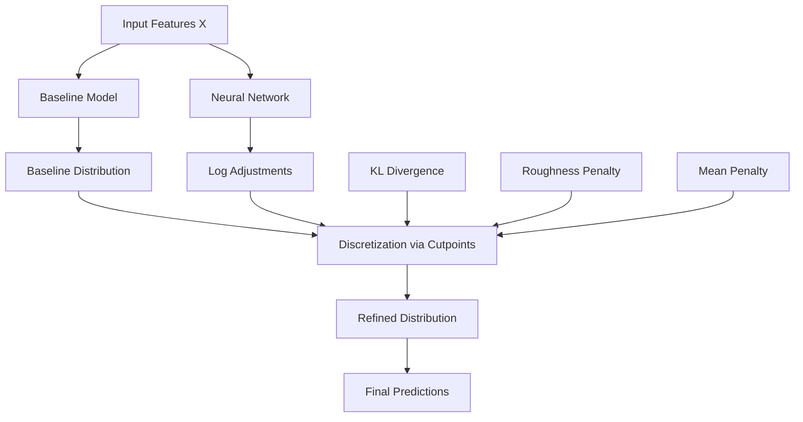

# DRN - Distributional Refinement Network

The main DRN model that combines interpretable baselines with flexible neural network refinements for advanced distributional forecasting.

---

## Class Definition

::: drn.models.drn.DRN
    options:
      show_root_heading: false
      show_source: false  
      heading_level: 3
      show_bases: true

---

## Overview

The **Distributional Refinement Network (DRN)** is the flagship model of this package. It addresses the fundamental challenge of building models that are both interpretable and flexible by:

1. **Starting with an interpretable baseline** (typically a GLM)
2. **Adding neural refinements** through a deep network
3. **Operating on discretized regions** defined by cutpoints  
4. **Balancing flexibility with regularization** through multiple penalty terms

The result is a model that maintains the interpretability of the baseline while achieving superior distributional forecasting performance.

## Architecture Overview



---

## Key Parameters

### Model Architecture
The core model structure is controlled by the `baseline` model (typically a GLM), `cutpoints` for discretization, and neural network dimensions via `hidden_size` (default: 75) and `num_hidden_layers` (default: 2). Dropout regularization is applied at rate `dropout_rate` (default: 0.2).

### Training Control  
Set `baseline_start=True` to initialize neural weights at zero, effectively starting from the baseline model. The `learning_rate` defaults to 1e-3 for the Adam optimizer, and `loss_metric` can be either "jbce" or "nll".

### Regularization Parameters
Three main penalty terms control model behavior: `kl_alpha` penalizes deviation from the baseline distribution, `mean_alpha` constrains mean predictions, and `dv_alpha` enforces density smoothness. The `kl_direction` parameter controls whether KL divergence is computed forwards or backwards.

---

## Quick Start

### Basic DRN Training

```python
from drn import GLM, DRN, train
from drn.models import drn_cutpoints, drn_loss
import torch

# 1. Train interpretable baseline
baseline = GLM('gamma')
baseline.fit(X_train, y_train)

# 2. Define refinement region  
cutpoints = drn_cutpoints(
    c_0=y_train.min() * 0.9,  # Lower bound should be below minimum
    c_K=y_train.max() * 1.1,  # Upper bound should be above maximum  
    proportion=0.1,           # 10% cutpoints-to-observation ratio
    y=y_train,
    min_obs=10               # Minimum observations per interval
)

# 3. Initialize DRN
drn_model = DRN(
    baseline=baseline,
    cutpoints=cutpoints,
    hidden_size=128,
    num_hidden_layers=2,
    dropout_rate=0.1
)

# 4. Train with custom loss
train_dataset = torch.utils.data.TensorDataset(
    torch.tensor(X_train.values, dtype=torch.float32),
    torch.tensor(y_train.values, dtype=torch.float32)
)
val_dataset = torch.utils.data.TensorDataset(
    torch.tensor(X_val.values, dtype=torch.float32),
    torch.tensor(y_val.values, dtype=torch.float32)
)

train(
    drn_model,
    lambda pred, y: drn_loss(
        pred, y,
        kl_alpha=1e-4,
        dv_alpha=1e-3,
        mean_alpha=1e-5
    ),
    train_dataset,
    val_dataset,
    epochs=100
)
```

---

## Cutpoints System

The heart of DRN's flexibility lies in its cutpoints system, which discretizes the response space into refinement regions.

### Cutpoint Generation

::: drn.models.drn_cutpoints
    options:
      show_root_heading: false
      show_source: false
      heading_level: 4

### Cutpoint Strategies

```python
from drn.models import drn_cutpoints
import numpy as np

# Strategy 1: Quantile-based (recommended)
cutpoints = drn_cutpoints(
    c_0=y_train.quantile(0.01),  # 1st percentile lower bound
    c_K=y_train.quantile(0.99),  # 99th percentile upper bound  
    proportion=0.08,             # 8% cutpoints-to-observation ratio
    y=y_train,
    min_obs=15
)

# Strategy 2: Fixed bounds
cutpoints = drn_cutpoints(
    c_0=0,              # Fixed lower bound
    c_K=1000,           # Fixed upper bound
    proportion=0.1,
    y=y_train,
    min_obs=20
)

# Strategy 3: Data-driven bounds
margin = (y_train.max() - y_train.min()) * 0.1
cutpoints = drn_cutpoints(
    c_0=y_train.min() - margin,
    c_K=y_train.max() + margin,
    proportion=0.05,
    y=y_train,
    min_obs=25
)

print(f"Generated {len(cutpoints)} cutpoints")
print(f"Refinement range: [{cutpoints[0]:.2f}, {cutpoints[-1]:.2f}]")
```

### Handling Different Data Ranges

**⚠️ Critical**: The cutpoint bounds `c_0` and `c_K` must appropriately cover your data range:

**For Positive Data (insurance claims, prices, etc.)**:
```python
# For data that can only be positive
cutpoints = drn_cutpoints(
    c_0=max(0, y_train.min() * 0.9),  # Ensure c_0 ≥ 0
    c_K=y_train.max() * 1.1,
    proportion=0.1,
    y=y_train,
    min_obs=10
)
```

**For Data Including Negative Values (profits/losses, temperature, etc.)**:
```python
# For data that can be negative  
margin = (y_train.max() - y_train.min()) * 0.1
cutpoints = drn_cutpoints(
    c_0=y_train.min() - margin,  # Allow for values below observed minimum
    c_K=y_train.max() + margin,  # Allow for values above observed maximum
    proportion=0.1,
    y=y_train,
    min_obs=10
)
```

**Why this matters**: DRN can only refine the predicted distributions within the cutpoint range `[c_0, c_K]`. If your data falls outside this range, predictions will revert to the baseline model.

---

## Regularization

DRN uses three penalty terms to balance baseline adherence with neural flexibility.

### KL Divergence Control (`kl_alpha`)

This parameter controls how much the refined distribution can deviate from the baseline. Values around 1e-5 maintain close adherence to the baseline, while 1e-4 provides moderate refinement, and 1e-3 allows aggressive deviations. The `kl_direction` parameter determines whether the penalty is computed as KL(baseline || drn) for 'forwards' or KL(drn || baseline) for 'backwards'.

### Roughness Penalty (`dv_alpha`)

Higher values (1e-2) enforce very smooth densities, while lower values (1e-4) permit complex density shapes. The default 1e-3 provides a reasonable balance between flexibility and smoothness.

### Mean Penalty (`mean_alpha`)

This constrains how much the predicted mean can deviate from the baseline mean. Set to 1e-3 to force close adherence, 1e-5 for moderate constraint, or 0.0 to allow free mean adjustment.

---

## Training Example

```python
from drn import GLM, DRN, train
from drn.models import drn_cutpoints, drn_loss
from drn.utils import split_and_preprocess
import torch

# Load and preprocess data
x_train, x_val, x_test, y_train, y_val, y_test, *_ = split_and_preprocess(
    X, y, test_size=0.2, val_size=0.1, seed=42
)

# Train baseline and create DRN
baseline = GLM('gamma').fit(x_train, y_train)
cutpoints = drn_cutpoints(
    c_0=y_train.quantile(0.01), c_K=y_train.quantile(0.99),
    proportion=0.08, y=y_train, min_obs=20
)

drn_model = DRN(baseline, cutpoints, hidden_size=128, num_hidden_layers=2)

# Train with regularized loss
train_data = torch.utils.data.TensorDataset(
    torch.tensor(x_train.values, dtype=torch.float32),
    torch.tensor(y_train.values, dtype=torch.float32)
)
val_data = torch.utils.data.TensorDataset(
    torch.tensor(x_val.values, dtype=torch.float32),
    torch.tensor(y_val.values, dtype=torch.float32)
)

loss_fn = lambda pred, y: drn_loss(pred, y, kl_alpha=1e-4, dv_alpha=1e-3)
train(drn_model, loss_fn, train_data, val_data, epochs=50)
```

---

## Advanced Features

### Custom Loss Functions

```python
def custom_drn_loss(pred_dist, y_true):
    """Custom loss with domain-specific penalties."""
    
    # Base DRN loss
    base_loss = drn_loss(pred_dist, y_true, 
                        kl_alpha=1e-4, dv_alpha=1e-3, mean_alpha=1e-5)
    
    # Custom penalty: discourage predictions below zero
    mean_pred = pred_dist.mean  
    negative_penalty = torch.mean(torch.relu(-mean_pred)) * 1e-2
    
    # Custom penalty: encourage reasonable variance
    if hasattr(pred_dist, 'variance'):
        var_penalty = torch.mean(torch.relu(pred_dist.variance - y_true.var() * 5))
        return base_loss + negative_penalty + var_penalty * 1e-4
    
    return base_loss + negative_penalty
```

### Lazy Initialization

```python
# DRN can automatically determine cutpoints during training
drn_model = DRN(
    baseline=baseline,
    cutpoints=None,         # Will be determined automatically
    proportion=0.08,        # Cutpoints-to-observation ratio
    min_obs=15,            # Minimum observations per interval
    hidden_size=128
)

# Cutpoints are created during .fit() call
drn_model.fit(X_train, y_train)
print(f"Auto-generated {len(drn_model.cutpoints)} cutpoints")
```

### Multi-Stage Training

```python
# Stage 1: High regularization for stable initialization
stage1_loss = lambda pred, y: drn_loss(pred, y, 
                                      kl_alpha=1e-3, dv_alpha=1e-2, mean_alpha=1e-4)
train(drn_model, stage1_loss, train_dataset, val_dataset, epochs=30)

# Stage 2: Reduce regularization for flexibility  
stage2_loss = lambda pred, y: drn_loss(pred, y,
                                      kl_alpha=1e-4, dv_alpha=1e-3, mean_alpha=1e-5)
train(drn_model, stage2_loss, train_dataset, val_dataset, epochs=50)

# Stage 3: Fine-tuning with minimal regularization
stage3_loss = lambda pred, y: drn_loss(pred, y,
                                      kl_alpha=1e-5, dv_alpha=1e-4, mean_alpha=0)
train(drn_model, stage3_loss, train_dataset, val_dataset, epochs=20)
```

---

## Hyperparameter Tuning Guide

### Tuning Strategy

1. **Start Conservative**: `kl_alpha=1e-4, dv_alpha=1e-3, mean_alpha=1e-5`
2. **Check Baseline Quality**: If baseline is poor, decrease `kl_alpha`
3. **Monitor Smoothness**: If densities are jagged, increase `dv_alpha`
4. **Adjust Complexity**: More cutpoints = more flexibility but harder training

### Systematic Grid Search

```python
def tune_drn_hyperparameters(baseline, X_train, Y_train, X_val, Y_val):
    """Simple hyperparameter tuning for DRN."""
    
    best_score = float('inf')
    best_params = None
    
    # Define search grid
    kl_alphas = [1e-5, 1e-4, 1e-3]
    dv_alphas = [1e-4, 1e-3, 1e-2]  
    hidden_sizes = [64, 128, 256]
    
    for kl_alpha in kl_alphas:
        for dv_alpha in dv_alphas:
            for hidden_size in hidden_sizes:
                
                # Create model
                drn = DRN(baseline, cutpoints, hidden_size=hidden_size)
                
                # Define loss
                loss_fn = lambda pred, y: drn_loss(pred, y, 
                                                  kl_alpha=kl_alpha, 
                                                  dv_alpha=dv_alpha)
                
                # Train
                train(drn, loss_fn, train_dataset, val_dataset, epochs=30)
                
                # Evaluate  
                pred = drn.predict(X_val)
                score = rmse(Y_val, pred.mean)
                
                if score < best_score:
                    best_score = score
                    best_params = {
                        'kl_alpha': kl_alpha,
                        'dv_alpha': dv_alpha, 
                        'hidden_size': hidden_size
                    }
    
    return best_params, best_score
```

---

## Troubleshooting

### ⚠️ Common Issues

#### Training Loss Not Decreasing
```python
# Solutions:
# 1. Lower learning rate
drn_model = DRN(baseline, cutpoints, learning_rate=1e-4)

# 2. Reduce regularization  
loss_fn = lambda pred, y: drn_loss(pred, y, kl_alpha=1e-5, dv_alpha=1e-4)

# 3. Check baseline quality
baseline_pred = baseline.predict(X_val)
baseline_score = rmse(Y_val, baseline_pred.mean)
print(f"Baseline validation RMSE: {baseline_score}")
```

#### Memory Issues
```python
# Reduce batch size
train(drn_model, loss_fn, train_dataset, val_dataset, batch_size=64)

# Reduce model size
drn_model = DRN(baseline, cutpoints, hidden_size=64, num_hidden_layers=1)

# Use gradient accumulation
# Effective batch size = batch_size * accumulation_steps
```

#### Overfitting
```python
# Increase regularization
loss_fn = lambda pred, y: drn_loss(pred, y, kl_alpha=1e-3, dv_alpha=1e-2)

# Increase dropout
drn_model = DRN(baseline, cutpoints, dropout_rate=0.3)

# Reduce model capacity
drn_model = DRN(baseline, cutpoints, hidden_size=32, num_hidden_layers=1)
```

---

## See Also

- **[BaseModel](base.md)** - Common model interface
- **[GLM](glm.md)** - Baseline model implementation
- **[Training](../training.md)** - Advanced training strategies
- **[Quick Start](../../getting-started/quickstart.md)** - Practical examples
- **[Advanced Usage](../../getting-started/advanced-usage.md)** - Custom training loops