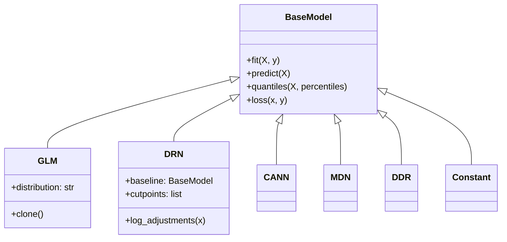

# Models Overview

Core distributional regression models in the DRN package. All models inherit from the common `BaseModel` interface and provide distributional predictions.

## Model Hierarchy



## Quick Reference

| Model | Purpose | Key Features | Best For |
|-------|---------|-------------|----------|
| **[BaseModel](base.md)** | Abstract base class | Common interface, PyTorch Lightning | All models inherit from this |
| **[GLM](glm.md)** | Generalized Linear Models | Interpretable, statistical foundation | Baseline models, simple relationships |
| **[DRN](drn.md)** | Distributional Refinement Network | Neural + interpretable baseline | Complex distributions with interpretability |
| **[CANN](others.md#cann)** | Combined Actuarial Neural Network | Actuarial focus, separate parameter networks | Insurance and actuarial applications |
| **[MDN](others.md#mdn)** | Mixture Density Network | Multi-modal distributions | Complex, multi-peaked data |
| **[DDR](others.md#ddr)** | Deep Distribution Regression | Pure neural approach | Maximum flexibility, no baseline constraint |
| **[Constant](others.md#constant)** | Constant prediction | Simple baseline | Benchmarking, ablation studies |

## Common Usage Patterns

### Basic Model Training
```python
from drn import GLM, DRN

# Train baseline
baseline = GLM('gamma')
baseline.fit(X_train, y_train)

# Train refined model
drn_model = DRN(baseline)
drn_model.fit(X_train, y_train)
```

### Distribution Families

#### GLM Distributions
- **`gaussian`** - Normal distribution for unbounded continuous data
- **`gamma`** - Gamma distribution for positive continuous data
- **`inversegaussian`** - Inverse Gaussian for positive data with right skew
- **`lognormal`** - Log-normal for multiplicative processes

#### Advanced Distributions
- **Histogram** - Flexible discrete distributions
- **Extended Histogram** - Continuous extensions of histograms
- **Mixture Models** - Multi-component distributions

### Model Selection Guide

#### Start with GLM when:
- You need interpretability
- Data follows standard distributions
- Baseline performance is adequate
- Statistical inference is required

#### Use DRN when:
- GLM baseline is reasonable but not sufficient
- You need both flexibility and interpretability
- Complex distributional shapes are present
- Regularization control is important

#### Consider Advanced Models when:
- **CANN**: Actuarial applications with domain knowledge
- **MDN**: Multi-modal or mixture distributions expected
- **DDR**: Maximum flexibility, no interpretability needed
- **Constant**: Simple benchmarking baseline

## Model Comparison

### Performance Characteristics

| Model | Training Speed | Inference Speed | Memory Usage | Interpretability | Flexibility |
|-------|---------------|----------------|--------------|------------------|-------------|
| GLM | ⭐⭐⭐⭐⭐ | ⭐⭐⭐⭐⭐ | ⭐⭐⭐⭐⭐ | ⭐⭐⭐⭐⭐ | ⭐⭐ |
| DRN | ⭐⭐⭐ | ⭐⭐⭐⭐ | ⭐⭐⭐ | ⭐⭐⭐⭐ | ⭐⭐⭐⭐ |
| CANN | ⭐⭐ | ⭐⭐⭐ | ⭐⭐ | ⭐⭐ | ⭐⭐⭐⭐ |
| MDN | ⭐⭐ | ⭐⭐⭐ | ⭐⭐ | ⭐⭐ | ⭐⭐⭐⭐⭐ |
| DDR | ⭐⭐ | ⭐⭐⭐ | ⭐⭐ | ⭐ | ⭐⭐⭐⭐⭐ |

### Implementation Status

| Model | Status | Documentation | Examples |
|-------|--------|---------------|----------|
| BaseModel | ✅ Complete | ✅ Full | ✅ Available |
| GLM | ✅ Complete | ✅ Full | ✅ Available |
| DRN | ✅ Complete | ✅ Full | ✅ Available |
| CANN | ✅ Complete | 🔄 Basic | 🔄 Coming |
| MDN | ✅ Complete | 🔄 Basic | 🔄 Coming |
| DDR | ✅ Complete | 🔄 Basic | 🔄 Coming |
| Constant | ✅ Complete | 🔄 Basic | 🔄 Coming |

## Next Steps

- **[BaseModel](base.md)** - Understand the common interface
- **[GLM](glm.md)** - Master the baseline models  
- **[DRN](drn.md)** - Learn the main DRN architecture
- **[Other Models](others.md)** - Explore advanced architectures

For practical usage examples, see:
- **[Quick Start](../../getting-started/quickstart.md)** - Pandas/numpy workflow
- **[Advanced Usage](../../getting-started/advanced-usage.md)** - Custom tensor operations