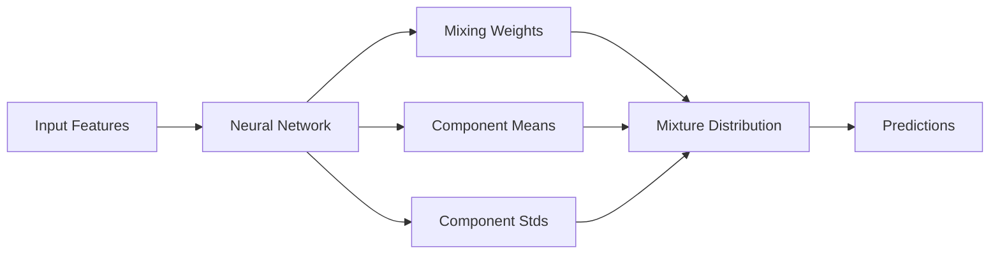

# MDN - Mixture Density Network

Neural network that models complex distributions as mixtures of simpler components.

---

## Class Definition

::: drn.models.mdn.MDN
    options:
      show_root_heading: false
      show_source: false
      heading_level: 3
      show_bases: true

## Overview

MDN (Mixture Density Network) is ideal for:
- **Multi-modal distributions** - Data with multiple peaks
- **Complex relationships** - Non-linear feature-target mappings
- **Uncertainty quantification** - Rich distributional representations
- **Flexible modeling** - Adaptive number of mixture components

## Architecture



## Quick Example

```python
from drn.models import MDN
import torch

# Initialize MDN with 3 mixture components
mdn_model = MDN(
    input_dim=8,
    num_components=3,
    hidden_size=128,
    num_hidden_layers=2
)

# Train on complex multimodal data
mdn_model.fit(X_train, y_train, epochs=150)

# Generate predictions
predictions = mdn_model.predict(X_test)

# Access mixture properties
mixing_weights = predictions.mixture_distribution.probs
component_means = predictions.mixture_distribution.component_distribution.mean
```

<!-- 
### Mode Collapse Prevention
```python
# Prevent components from collapsing to same mode
mdn_stable = MDN(
    input_dim=5,
    num_components=4,
    hidden_size=128,
    
    # Stability improvements
    component_regularization=1e-3,    # Keep components diverse
    minimum_component_weight=0.05,    # Minimum mixing weight
    initialization_strategy='diverse'  # Diverse initial components
)
``` -->
