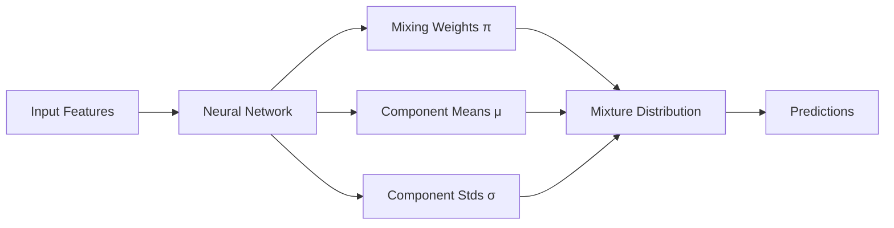

# Other Models

Additional distributional regression models in the DRN package: CANN, MDN, DDR, and Constant models.

---

## CANN - Combined Actuarial Neural Network {#cann}

Advanced neural network architecture designed specifically for actuarial and insurance applications.

### Class Definition

::: drn.models.cann.CANN
    options:
      show_root_heading: false
      show_source: false
      heading_level: 4
      show_bases: true

### Overview

CANN (Combined Actuarial Neural Network) extends traditional actuarial modeling by combining:
- **Separate networks** for different distributional parameters
- **Actuarial domain knowledge** built into the architecture
- **Flexible parameter modeling** with interpretable components

### Key Features
- **Parameter-specific networks** - Different neural networks for mean, dispersion, etc.
- **Actuarial constraints** - Built-in positivity and monotonicity constraints
- **Industry standard** - Widely used in insurance and risk modeling
- **Flexible distributions** - Support for various actuarial distributions

### Quick Example

```python
from drn.models import CANN
import torch

# Initialize CANN for insurance modeling
cann_model = CANN(
    input_dim=5,
    distribution='gamma',
    hidden_sizes=[64, 32],
    use_embedding=True  # For categorical variables
)

# Train on insurance data
cann_model.fit(X_train, y_train, epochs=100)

# Make predictions
predictions = cann_model.predict(X_test)
mean_claims = predictions.mean
risk_percentiles = cann_model.quantiles(X_test, [95, 99])
```

---

## MDN - Mixture Density Network {#mdn}

Neural network that models complex distributions as mixtures of simpler components.

### Class Definition

::: drn.models.mdn.MDN
    options:
      show_root_heading: false
      show_source: false
      heading_level: 4
      show_bases: true

### Overview

MDN (Mixture Density Network) is ideal for:
- **Multi-modal distributions** - Data with multiple peaks
- **Complex relationships** - Non-linear feature-target mappings
- **Uncertainty quantification** - Rich distributional representations
- **Flexible modeling** - Adaptive number of mixture components

### Key Features
- **Mixture modeling** - Combines multiple Gaussian components
- **Adaptive complexity** - Automatic component selection
- **Rich distributions** - Can approximate any continuous distribution
- **Neural flexibility** - Deep networks for component parameters

### Architecture



### Quick Example

```python
from drn.models import MDN
import torch

# Initialize MDN with 3 mixture components
mdn_model = MDN(
    input_dim=8,
    num_components=3,
    hidden_size=128,
    num_hidden_layers=2
)

# Train on complex multimodal data
mdn_model.fit(X_train, y_train, epochs=150)

# Generate predictions
predictions = mdn_model.predict(X_test)

# Access mixture properties
mixing_weights = predictions.mixture_distribution.probs
component_means = predictions.mixture_distribution.component_distribution.mean
```

### Advanced Usage

```python
# Adaptive component selection
mdn_adaptive = MDN(
    input_dim=5,
    num_components=5,
    component_selection='adaptive',  # Automatically select active components
    regularization_strength=1e-4
)

# Custom mixture distributions
from torch.distributions import Gamma, MixtureSameFamily, Categorical

mdn_gamma = MDN(
    input_dim=5,
    num_components=3,
    component_distribution='gamma'  # Gamma mixture instead of Gaussian
)
```

---

## DDR - Deep Distribution Regression {#ddr}

Pure neural network approach to distributional regression without baseline constraints.

### Class Definition

::: drn.models.ddr.DDR
    options:
      show_root_heading: false
      show_source: false
      heading_level: 4
      show_bases: true

### Overview

DDR (Deep Distribution Regression) provides:
- **Maximum flexibility** - No baseline model constraints
- **Pure neural approach** - End-to-end learned distributions
- **Histogram outputs** - Flexible discrete-continuous distributions
- **Advanced architectures** - Deep networks with sophisticated designs

### Key Features
- **Histogram distributions** - Learnable binned representations
- **No baseline dependency** - Pure neural learning
- **Flexible architectures** - Various network designs available
- **Advanced loss functions** - JBCE and other distributional losses

### Loss Functions

#### JBCE Loss

::: drn.models.ddr.jbce_loss
    options:
      show_root_heading: false
      show_source: false
      heading_level: 5

#### NLL Loss

::: drn.models.ddr.nll_loss
    options:
      show_root_heading: false
      show_source: false
      heading_level: 5

### Quick Example

```python
from drn.models import DDR, jbce_loss
from drn import train
import torch

# Initialize DDR with histogram output
ddr_model = DDR(
    input_dim=6,
    num_bins=50,
    hidden_size=256,
    num_hidden_layers=3,
    dropout_rate=0.2
)

# Train with JBCE loss
train_dataset = torch.utils.data.TensorDataset(X_train, y_train)
val_dataset = torch.utils.data.TensorDataset(X_val, y_val)

train(
    ddr_model,
    jbce_loss,
    train_dataset,
    val_dataset,
    epochs=200,
    lr=0.001
)

# Generate flexible distributions
predictions = ddr_model.predict(X_test)
histogram_probs = predictions.probs  # Bin probabilities
```

### Advanced DDR Training

```python
# Custom histogram bounds
ddr_custom = DDR(
    input_dim=5,
    num_bins=100,
    bin_range=(0, 1000),  # Custom range for insurance claims
    hidden_size=512,
    batch_norm=True,      # Add batch normalization
    residual_connections=True  # Add residual connections
)

# Multi-objective training
def custom_ddr_loss(pred_hist, y_true):
    """Custom DDR loss with multiple objectives."""
    
    # Base JBCE loss
    base_loss = jbce_loss(pred_hist, y_true)
    
    # Regularization: encourage smooth histograms
    probs = pred_hist.probs
    smoothness_penalty = torch.mean(torch.diff(probs, dim=-1) ** 2)
    
    # Sparsity: discourage too many active bins
    sparsity_penalty = torch.mean(torch.sum(probs > 0.01, dim=-1))
    
    return base_loss + 1e-3 * smoothness_penalty + 1e-4 * sparsity_penalty
```

---

## Constant - Constant Prediction Model {#constant}

Simple baseline model that predicts constant distributions for benchmarking and ablation studies.

### Class Definition

::: drn.models.constant.Constant
    options:
      show_root_heading: false
      show_source: false
      heading_level: 4
      show_bases: true

### Overview

The Constant model provides:
- **Simple baselines** - Predict same distribution for all inputs
- **Benchmarking** - Performance comparison baseline
- **Ablation studies** - Control model for feature importance
- **Sanity checks** - Verify that other models add value

### Key Features
- **Distribution fitting** - Fits single distribution to all training data
- **Fast inference** - No feature processing required
- **Multiple distributions** - Supports Gaussian, Gamma, etc.
- **Debugging tool** - Helps identify modeling issues

### Quick Example

```python
from drn.models import Constant

# Fit constant Gamma distribution
constant_model = Constant(distribution='gamma')
constant_model.fit(X_train, y_train)

# All predictions are identical
pred1 = constant_model.predict(X_test[:1])
pred2 = constant_model.predict(X_test[100:101])

# Same distribution parameters
assert torch.allclose(pred1.mean, pred2.mean)
assert torch.allclose(pred1.variance, pred2.variance)
```

### Use Cases

#### Benchmarking
```python
from drn.metrics import rmse, crps

# Compare against constant baseline
constant_baseline = Constant('gamma')
constant_baseline.fit(X_train, y_train)

your_model = SomeModel()
your_model.fit(X_train, y_train)

# Evaluate both
constant_pred = constant_baseline.predict(X_test)
your_pred = your_model.predict(X_test)

constant_rmse = rmse(y_test, constant_pred.mean)
your_rmse = rmse(y_test, your_pred.mean)

print(f"Constant baseline RMSE: {constant_rmse:.4f}")
print(f"Your model RMSE: {your_rmse:.4f}")
print(f"Improvement: {((constant_rmse - your_rmse) / constant_rmse * 100):.1f}%")
```

#### Ablation Studies
```python
# Test if features add value
constant_no_features = Constant('gamma')
constant_no_features.fit(None, y_train)  # No features used

glm_with_features = GLM('gamma')  
glm_with_features.fit(X_train, y_train)  # Uses all features

# Compare to see if features help
constant_score = evaluate_model(constant_no_features, X_test, y_test)
glm_score = evaluate_model(glm_with_features, X_test, y_test)

print(f"Features provide {((constant_score - glm_score) / constant_score * 100):.1f}% improvement")
```

---

## Model Comparison

### When to Use Each Model

| Model | Use When | Strengths | Weaknesses |
|-------|----------|-----------|------------|
| **CANN** | Actuarial applications, domain knowledge available | Industry-specific, parameter separation | Complex setup, less general |
| **MDN** | Multi-modal data, complex distributions | Very flexible, handles multimodality | Can overfit, harder to interpret |
| **DDR** | Maximum flexibility needed, no interpretability required | No constraints, very flexible | Black box, can overfit |
| **Constant** | Benchmarking, ablation studies | Simple, fast | No predictive power |

### Performance Characteristics

| Model | Training Time | Memory Usage | Flexibility | Interpretability | Stability |
|-------|--------------|--------------|-------------|------------------|-----------|
| CANN | ⭐⭐⭐ | ⭐⭐⭐ | ⭐⭐⭐⭐ | ⭐⭐⭐ | ⭐⭐⭐ |
| MDN | ⭐⭐ | ⭐⭐ | ⭐⭐⭐⭐⭐ | ⭐⭐ | ⭐⭐ |
| DDR | ⭐⭐ | ⭐⭐ | ⭐⭐⭐⭐⭐ | ⭐ | ⭐⭐ |
| Constant | ⭐⭐⭐⭐⭐ | ⭐⭐⭐⭐⭐ | ⭐ | ⭐⭐⭐⭐⭐ | ⭐⭐⭐⭐⭐ |

---

## Advanced Examples

### Ensemble Methods

```python
# Create ensemble of different models
from drn.metrics import crps

models = {
    'cann': CANN(input_dim=5, distribution='gamma'),
    'mdn': MDN(input_dim=5, num_components=3),
    'ddr': DDR(input_dim=5, num_bins=50)
}

# Train all models
for name, model in models.items():
    print(f"Training {name}...")
    model.fit(X_train, y_train, epochs=100)

# Generate ensemble predictions
predictions = {}
weights = {}

for name, model in models.items():
    pred = model.predict(X_val)
    predictions[name] = pred
    
    # Weight by validation performance
    val_crps = crps(y_val, grid, pred.cdf(grid)).mean()
    weights[name] = 1.0 / val_crps

# Normalize weights
total_weight = sum(weights.values())
weights = {k: v/total_weight for k, v in weights.items()}

# Weighted ensemble prediction (simplified)
ensemble_mean = sum(weights[name] * pred.mean for name, pred in predictions.items())
```

### Custom Architecture Combinations

```python
# Multi-stage model: GLM → DRN → DDR refinement
stage1 = GLM('gamma')
stage1.fit(X_train, y_train)

stage2 = DRN(stage1, cutpoints=cutpoints)
train(stage2, drn_loss, train_dataset, val_dataset, epochs=50)

# Use DRN predictions as features for DDR
stage2_pred = stage2.predict(X_train)
enhanced_features = torch.cat([X_train, stage2_pred.mean.unsqueeze(1)], dim=1)

stage3 = DDR(input_dim=enhanced_features.shape[1], num_bins=30)
enhanced_dataset = torch.utils.data.TensorDataset(enhanced_features, y_train)
train(stage3, jbce_loss, enhanced_dataset, val_dataset, epochs=75)
```

---

## See Also

- **[BaseModel](base.md)** - Common model interface
- **[GLM](glm.md)** - Baseline models
- **[DRN](drn.md)** - Main DRN architecture  
- **[Training](../training.md)** - Training utilities
- **[Advanced Usage](../../getting-started/advanced-usage.md)** - Custom implementations