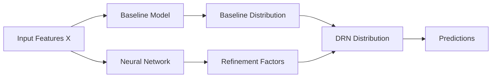

# Basic Concepts

This page introduces the fundamental concepts behind Distributional Refinement Networks (DRN) and distributional regression modeling.

## What is Distributional Regression?

Traditional regression models predict a single value (the mean) for each input. **Distributional regression** goes beyond this by modeling the entire conditional distribution of the response variable given the features.

### Traditional Regression
```
X → μ (mean only)
```

### Distributional Regression
```
X → P(Y|X) (entire distribution)
```

This allows us to predict:
- **Mean**: Expected value
- **Quantiles**: Risk measures (e.g., 95th percentile)
- **Density**: Full probability distribution
- **Uncertainty**: Prediction intervals and confidence

## The DRN Architecture

### Core Philosophy

DRN addresses three key challenges in actuarial and statistical modeling:

1. **Flexible Covariate Effects**: Features should be able to affect different parts of the distribution differently
2. **Interpretability vs. Performance**: Maintain model transparency while leveraging ML advances
3. **Distributional Focus**: Model the entire distribution, not just the mean

### Two-Stage Approach



#### Stage 1: Baseline Model
- Usually a **Generalized Linear Model (GLM)**
- Provides interpretable foundation
- Captures main relationships in data
- Well-understood statistical properties

#### Stage 2: Neural Refinement
- **Deep neural network** refines the baseline
- Operates on discretized regions (cutpoints)
- Constrained by regularization terms
- Maintains distributional coherence

### Mathematical Framework

For a given input **x**, the DRN produces a distribution where:

- **Baseline**: `P₀(y|x)` from GLM or other interpretable model
- **Refinement**: Neural network produces adjustment factors
- **Final Distribution**: Refined distribution that respects baseline structure

The refinement is controlled by three key regularization terms:

1. **KL Divergence** (`kl_alpha`): Controls deviation from baseline distribution
2. **Roughness Penalty** (`dv_alpha`): Ensures smooth density functions
3. **Mean Penalty** (`mean_alpha`): Controls deviation from baseline mean

## Key Components

### 1. Cutpoints System

DRN operates on **discretized regions** of the response variable:

```
[c₀, c₁) [c₁, c₂) ... [cₖ₋₁, cₖ]
```

- **c₀**: Lower bound of refinement region
- **cₖ**: Upper bound of refinement region  
- **Number of intervals**: Determined by cutpoints-to-observation ratio `p`

**Why discretize?**
- Makes neural network training stable
- Allows flexible density shapes
- Enables efficient computation
- Maintains probabilistic coherence

### 2. Distribution Objects

All models return **distribution objects** with methods:

```python
dist = model.predict(X)

# Point estimates
mean = dist.mean                    # Expected value
mode = dist.mode                    # Most likely value

# Distributional properties  
pdf = dist.density(y_grid)          # Probability density
cdf = dist.cdf(y_grid)              # Cumulative distribution
quantiles = dist.quantiles([5, 95]) # Risk measures

# Evaluation
log_prob = dist.log_prob(y_true)    # Log-likelihood
```

### 3. Training Framework

DRN training follows a specific pattern:

```python
# 1. Train baseline
baseline = GLM('gaussian').fit(X, y)

# 2. Define refinement region
cutpoints = drn_cutpoints(c_0, c_K, p, y, min_obs)

# 3. Initialize DRN
drn = DRN(baseline, cutpoints, hidden_size=128)

# 4. Train with custom loss
train(drn, drn_loss, train_data, val_data)
```

## Model Types in DRN

### Baseline Models

#### GLM (Generalized Linear Models)
- **Gaussian**: Normal distribution with linear mean
- **Gamma**: Gamma distribution for positive responses
- Interpretable coefficients
- Well-established statistical theory

#### Constant Model
- Simple baseline predicting constant distribution
- Useful for ablation studies
- Minimal computational overhead

### Advanced Models

#### DRN (Distributional Refinement Network)
- **Main model** of the package
- Combines interpretable baseline + neural refinement
- Flexible distribution shapes
- Controlled regularization

#### CANN (Combined Actuarial Neural Network)
- Actuarial-focused architecture
- Separate networks for different distributional parameters
- Industry-standard approach

#### MDN (Mixture Density Network)
- Models multimodal distributions
- Mixture of simple distributions
- Good for complex, multi-peaked data

#### DDR (Deep Distribution Regression)
- Pure neural approach to distributional regression
- No baseline constraint
- Maximum flexibility

## Regularization and Control

### KL Divergence Control (`kl_alpha`)

Controls how much the final distribution can deviate from the baseline:

- **Small values (1e-5 to 1e-4)**: Stay close to baseline
- **Larger values**: Allow more deviation
- **Direction**: Forward or reverse KL divergence

### Roughness Penalty (`dv_alpha`)

Ensures smooth density functions:

- **Larger values**: Smoother densities
- **Smaller values**: Allow more complex shapes
- **Balance**: Trade-off between flexibility and stability

### Mean Penalty (`mean_alpha`)

Controls deviation of predicted mean from baseline:

- **Zero**: No constraint on mean
- **Small values (1e-5 to 1e-4)**: Gentle constraint
- **Larger values**: Force mean to stay close to baseline

## Evaluation Metrics

### Distribution-Aware Metrics

Unlike traditional regression, distributional models need special evaluation:

#### CRPS (Continuous Ranked Probability Score)
- Measures difference between predicted CDF and observed outcome
- Lower is better
- Rewards both accuracy and calibration

#### Quantile Loss
- Evaluates specific quantile predictions
- Asymmetric loss function
- Important for risk management

#### Log-Likelihood (NLL)
- Measures how well model assigns probability to observed outcomes
- Higher likelihood = better fit
- Can overfit if not regularized

### Traditional Metrics
- **RMSE**: Still useful for mean predictions
- **MAE**: Less sensitive to outliers
- **R²**: Explained variance (for means only)

<!-- ## Use Cases and Applications

### Actuarial Science
- **Loss reserving**: Model claim distributions
- **Premium pricing**: Risk-based pricing
- **Capital modeling**: Tail risk estimation

### Finance
- **Value at Risk (VaR)**: Quantile-based risk measures
- **Portfolio optimization**: Return distribution modeling
- **Credit scoring**: Default probability distributions

### General Statistics
- **Uncertainty quantification**: Prediction intervals
- **Robust modeling**: Handle heteroskedastic data  
- **Multi-output regression**: Joint distributions -->

## Next Steps

Now that you understand the concepts, you can:

1. **Try the [Quick Start Guide](quickstart.md)** - Hands-on experience
2. **Explore [Advanced Usage](advanced-usage.md)** - Step-by-step examples
3. **Read [User Guide](../user-guide/index.md)** - Best practices
4. **Check [API Reference](../api/models/base.md)** - Technical details

## Further Reading

- [DRN Paper](https://arxiv.org/abs/2406.00998) - Theoretical foundation
- [CANN Paper](https://papers.ssrn.com/sol3/papers.cfm?abstract_id=3320525) - Actuarial neural networks
- [MDN Paper](https://publications.aston.ac.uk/id/eprint/373/1/NCRG_94_004.pdf) - Mixture density networks