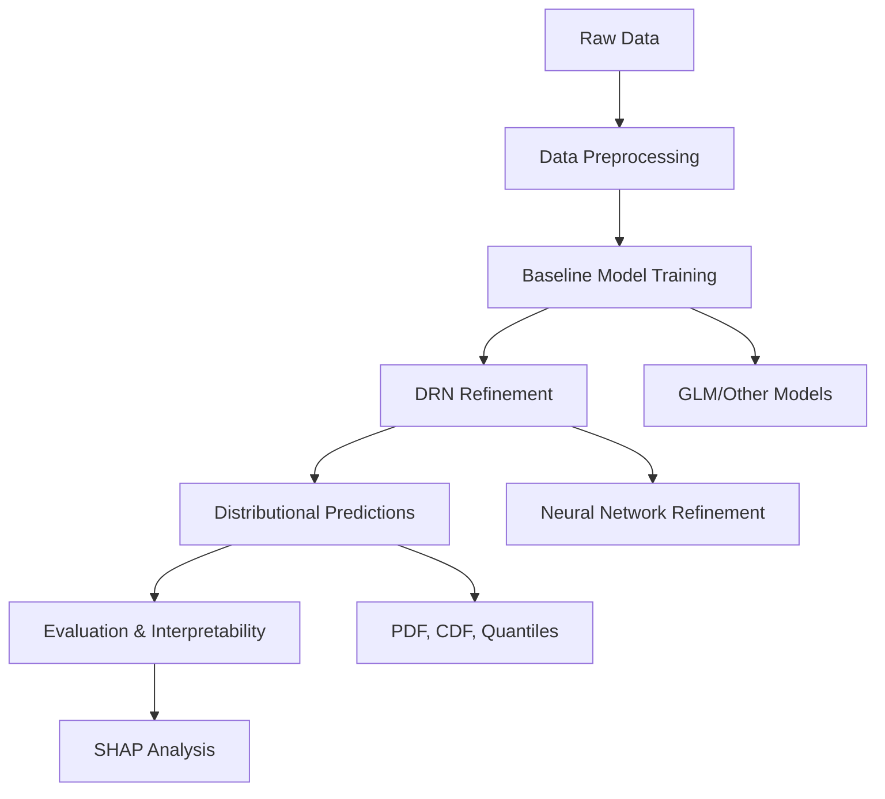

# DRN: Distributional Refinement Networks

[](https://badge.fury.io/py/drn)
[](https://www.python.org/downloads/)
[](https://opensource.org/licenses/MIT)

A PyTorch-based library for **Distributional Refinement Networks** and distributional regression modeling, combining interpretable baseline models with flexible neural networks for advanced distributional forecasting in actuarial and statistical contexts.

## 🚀 Quick Start

```python
from drn import GLM, DRN
import pandas as pd

# Load your data
DATA_URL = "https://raw.githubusercontent.com/agi-lab/DRN/refs/heads/main/data/processed/synth/"
X_train = pd.read_csv(DATA_URL + "x_train.csv")
y_train = pd.read_csv(DATA_URL + "y_train.csv")

# Train a baseline GLM
glm_model = GLM("gamma").fit(X_train, y_train)

# Create and train a DRN
drn_model = DRN(glm_model).fit(X_train, y_train)

# Make distributional predictions
predictions = drn_model.predict(X_test)
mean_pred = predictions.mean
quantiles = predictions.quantiles([10, 50, 90])
```

## 🎯 Key Features

### **Comprehensive Distributional Regression Models**
- **Distributional Refinement Network (DRN)**: The main model combining baseline + neural refinement
- **Combined Actuarial Neural Network (CANN)**: Flexible actuarial modeling
- **Mixture Density Network (MDN)**: Multi-modal distribution modeling
- **Deep Distribution Regression (DDR)**: Neural distributional regression
- **Generalized Linear Models (GLM)**: Interpretable baseline models

### **Exceptional Distributional Flexibility**
- Model entire distributions for forecasting
- User-controlled refinement range across all quantiles
- Tailored regularization with KL divergence, roughness penalty, and mean penalty
- Support for bounded, unbounded, discrete, continuous, or mixed response variables

### **Full Distributional Forecasting**
- Complete distributional information: density, CDF, mean, and quantiles
- Comprehensive evaluation metrics: RMSE, Quantile Loss, CRPS, NLL
- Performance assessment across different aspects of distributional forecasting

### **Reasonable Distributional Interpretability**
- Integrated Kernel SHAP analysis for distributional properties
- Decomposition of baseline model and DRN contributions
- Customized post-hoc interpretability for density and CDF
- Understanding of model adjustments beyond the mean

## 🏗️ Architecture Overview

The DRN package is built around several core components:



### Models (`src/drn/models/`)
- **BaseModel**: Abstract foundation for all distributional regression models
- **DRN**: Main distributional refinement network
- **GLM**: Generalized linear models with Gaussian and Gamma distributions
- **CANN, MDN, DDR**: Advanced neural distributional models

### Core Utilities
- **Training Framework**: PyTorch-based with early stopping and validation
- **Metrics**: Comprehensive evaluation tools (CRPS, RMSE, quantile loss, NLL)
- **Interpretability**: Kernel SHAP integration for distributional explanations
- **Preprocessing**: Data splitting, scaling, and categorical encoding

## 📖 The DRN Approach

Distributional Refinement Networks address three key challenges in actuarial modeling:

1. **Flexible Covariate Impact**: Allow features to influence different aspects of the conditional distribution
2. **ML Integration**: Combine machine learning advances while maintaining interpretability
3. **Interpretable Predictions**: Preserve model transparency for trusted decision-making

The DRN achieves this by:
- Starting with an interpretable baseline model (typically a GLM)
- Applying neural network refinements to the entire distribution
- Balancing flexibility with interpretability through regularization
- Providing comprehensive distributional explanations via SHAP

## 🔗 Related Work

This package accompanies the [DRN paper](https://arxiv.org/abs/2406.00998) on Distributional Refinement Networks. For reproducible research and additional experiments, visit our [research repository](https://github.com/agi-lab/DRN).

## 📚 Documentation Structure

- **[Getting Started](getting-started/installation.md)**: Installation and basic setup
- **[User Guide](user-guide/index.md)**: In-depth usage patterns
- **[API Reference](api/index.md)**: Complete technical documentation
- **[Examples](examples/index.md)**: Real-world applications and comparisons

## 🤝 Contributing

We welcome contributions! Please see our [Development Guide](development/index.md) for details on how to get started.

## 📄 Citation

If you use DRN in your research, please cite:

```bibtex
@misc{avanzi2024distributional,
    title={Distributional Refinement Network: Distributional Forecasting via Deep Learning}, 
    author={Benjamin Avanzi and Eric Dong and Patrick J. Laub and Bernard Wong},
    year={2024},
    eprint={2406.00998},
    archivePrefix={arXiv},
    primaryClass={stat.ML}
}
```

## 📞 Contact

For questions or support, please contact [tiandong1999@gmail.com](mailto:tiandong1999@gmail.com).