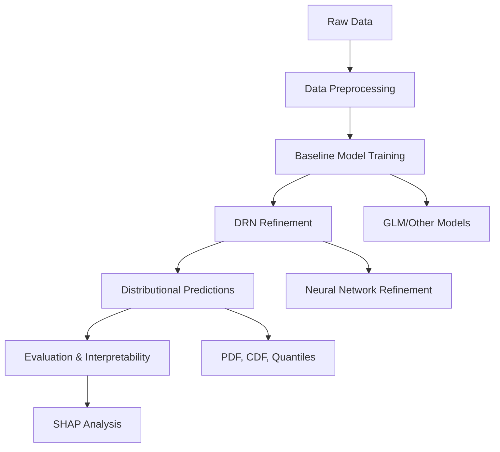

# Distributional Refinement Network Python Package

[](https://badge.fury.io/py/drn)
[](https://www.python.org/downloads/)
[](https://opensource.org/licenses/MIT)

A PyTorch-based library for **Distributional Refinement Networks** and distributional regression modeling, combining interpretable baseline models with flexible neural networks for advanced distributional forecasting in actuarial and statistical contexts.

## Quick Start

```python
from drn import GLM, DRN
import pandas as pd

# Load your data
DATA_URL = "https://raw.githubusercontent.com/agi-lab/DRN/refs/heads/main/data/processed/synth/"
X_train = pd.read_csv(DATA_URL + "x_train.csv")
y_train = pd.read_csv(DATA_URL + "y_train.csv")

# Train a baseline GLM
glm_model = GLM("gamma").fit(X_train, y_train)

# Create and train a DRN
drn_model = DRN(glm_model).fit(X_train, y_train)

# Make distributional predictions
predictions = drn_model.predict(X_test)
mean_pred = predictions.mean
quantiles = predictions.quantiles([10, 50, 90])
```

## Key Features

**Comprehensive Model Suite**: The package includes Distributional Refinement Networks (DRN) as the main model, alongside Combined Actuarial Neural Networks (CANN), Mixture Density Networks (MDN), Deep Distribution Regression (DDR), and interpretable Generalized Linear Models (GLM).

**Distributional Flexibility**: Rather than predicting single point estimates, these models forecast entire distributions with user-controlled refinement ranges. The framework supports bounded, unbounded, discrete, continuous, or mixed response variables through tailored regularization including KL divergence, roughness penalties, and mean constraints.

**Complete Evaluation Framework**: Models provide full distributional information including density functions, CDFs, means, and quantiles. Evaluation uses both traditional metrics (RMSE) and distributional measures (CRPS, Quantile Loss, NLL).

**Interpretability**: Integrated Kernel SHAP analysis decomposes baseline and neural contributions, providing understanding of model adjustments beyond simple mean predictions.

## Architecture Overview



The package centers around several model classes inheriting from BaseModel, including the main DRN implementation, GLM baselines with Gaussian and Gamma distributions, and advanced neural models (CANN, MDN, DDR). Supporting utilities provide PyTorch-based training with early stopping, comprehensive evaluation metrics, SHAP-based interpretability, and data preprocessing.

## The DRN Approach

Distributional Refinement Networks address three key challenges in actuarial modeling: enabling flexible covariate impact across different aspects of the conditional distribution, integrating machine learning advances while maintaining interpretability, and preserving model transparency for trusted decision-making.

The approach starts with an interpretable baseline model (typically a GLM), then applies neural network refinements to the entire distribution. Regularization balances flexibility with interpretability, while SHAP analysis provides comprehensive distributional explanations.

## Related Work

This package accompanies the [DRN paper](https://arxiv.org/abs/2406.00998) on Distributional Refinement Networks. For reproducible research and additional experiments, visit our [research repository](https://github.com/agi-lab/DRN).

## Documentation Structure

The documentation covers installation and basic setup in [Getting Started](getting-started/quickstart.md), complete technical specifications in the [API Reference](api/index.md).

## Contributing

Contributions are welcome.

## Citation

If you use DRN in your research, please cite:

```bibtex
@misc{avanzi2024distributional,
    title={Distributional Refinement Network: Distributional Forecasting via Deep Learning}, 
    author={Benjamin Avanzi and Eric Dong and Patrick J. Laub and Bernard Wong},
    year={2024},
    eprint={2406.00998},
    archivePrefix={arXiv},
    primaryClass={stat.ML}
}
```

## Contact

For questions or support, contact [tiandong1999@gmail.com](mailto:tiandong1999@gmail.com).